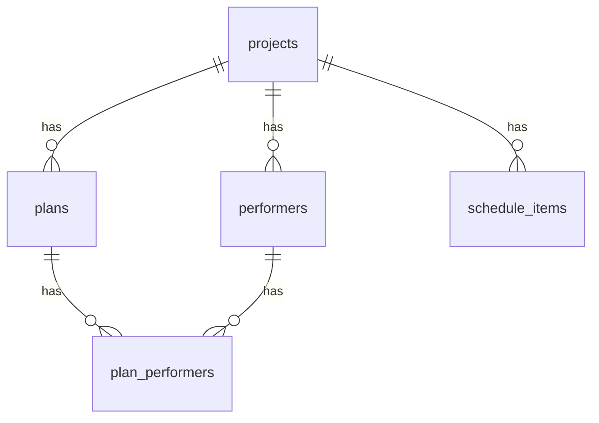

# DATABASE_SCHEMA.md

## 1. データベース接続情報
- プロジェクトURL: NEXT_PUBLIC_SUPABASE_URL（環境変数）
- 使用リージョン: Tokyo（`supabase projects list` より対象プロジェクト）
- データベースバージョン: PostgreSQL（Supabase 標準、詳細バージョンはCLIダンプ未取得）

## 2. テーブル定義

### projects
| カラム名 | データ型 | NULL許可 | デフォルト値 | 説明 |
|---------|---------|----------|-------------|------|
| id | uuid | NO | gen_random_uuid() | 主キー |
| title | varchar(255) | NO |  | プロジェクト名 |
| recording_date | date | NO |  | 収録日 |
| total_recording_time | varchar(100) | NO |  | 収録全体時間（例 09:00-18:00） |
| location | varchar(255) | NO |  | 収録場所名 |
| location_map_url | text | YES |  | 地図URL |
| address | text | YES |  | 住所（20241213 追加） |
| created_at | timestamptz | YES | now() | 作成日時 |
| updated_at | timestamptz | YES | now() | 更新日時 |

**インデックス:**
- idx: performers.project_id, plans.project_id 経由で参照

**RLSポリシー:**（README 初期SQL例）
- Allow all operations: 全操作許可（開発初期設定、本番は要制限）

---

### performers
| カラム名 | データ型 | NULL許可 | デフォルト値 | 説明 |
|---------|---------|----------|-------------|------|
| id | uuid | NO | gen_random_uuid() | 主キー |
| project_id | uuid | NO |  | projects.id 参照（ON DELETE CASCADE） |
| name | varchar(255) | NO |  | 氏名 |
| role | varchar(255) | YES |  | 役割（任意） |
| start_time | time | YES |  | 入り時間 |
| end_time | time | YES |  | 終わり時間 |
| available_start_time | time | YES |  | 調整可能開始 |
| available_end_time | time | YES |  | 調整可能終了 |
| is_time_confirmed | boolean | YES | false | 時間確定フラグ |
| belongings | text | YES |  | 持ち物（20241216 追加） |
| program_items | text | YES |  | 番組側準備物（`migration_add_program_items.sql`） |
| created_at | timestamptz | YES | now() | 作成日時 |
| updated_at | timestamptz | YES | now() | 更新日時 |

**外部キー:**
- performers.project_id → projects.id (ON DELETE CASCADE)

**RLSポリシー:**
- Allow all operations（開発初期）

---

### plans
| カラム名 | データ型 | NULL許可 | デフォルト値 | 説明 |
|---------|---------|----------|-------------|------|
| id | uuid | NO | gen_random_uuid() | 主キー |
| project_id | uuid | NO |  | projects.id 参照（ON DELETE CASCADE） |
| title | varchar(255) | NO |  | 企画名 |
| scheduled_time | time | NO |  | 企画開始 |
| duration | varchar(100) | NO |  | 尺（例 30分, 1時間30分） |
| script_url | text | YES |  | 台本URL/台本なし |
| has_script | boolean | YES | false | 台本有無 |
| notes | text | YES |  | 補足 |
| reference_video_url | text | YES |  | 参考動画URL |
| is_confirmed | boolean | YES | false | 企画確定フラグ |
| created_at | timestamptz | YES | now() | 作成日時 |
| updated_at | timestamptz | YES | now() | 更新日時 |

**外部キー:**
- plans.project_id → projects.id (ON DELETE CASCADE)

**RLSポリシー:**
- Allow all operations（開発初期）

---

### plan_performers
| カラム名 | データ型 | NULL許可 | デフォルト値 | 説明 |
|---------|---------|----------|-------------|------|
| id | uuid | NO | gen_random_uuid() | 主キー |
| plan_id | uuid | NO |  | plans.id 参照（ON DELETE CASCADE） |
| performer_id | uuid | NO |  | performers.id 参照（ON DELETE CASCADE） |
| role | varchar(255) | NO |  | 役割 |
| created_at | timestamptz | YES | now() | 作成日時 |

**制約:**
- UNIQUE(plan_id, performer_id)

**RLSポリシー:**
- Allow all operations（開発初期）

---

### schedule_items（20241216 追加）
| カラム名 | データ型 | NULL許可 | デフォルト値 | 説明 |
|---------|---------|----------|-------------|------|
| id | uuid | NO | gen_random_uuid() | 主キー |
| project_id | uuid | NO |  | projects.id 参照（ON DELETE CASCADE） |
| type | varchar(20) | NO |  | 'break' | 'preparation' | 'custom' |
| title | varchar(255) | NO |  | 項目名 |
| start_time | time | NO |  | 開始時刻 |
| duration | integer | NO |  | 分単位の長さ |
| created_at | timestamptz | YES | now() | 作成日時 |
| updated_at | timestamptz | YES | now() | 更新日時 |

**インデックス:**
- idx_schedule_items_project_id (project_id)
- idx_schedule_items_start_time (start_time)

**RLSポリシー:**
- Allow all operations（開発初期）

---

### proposals
| カラム名 | データ型 | NULL許可 | デフォルト値 | 説明 |
|---------|---------|----------|-------------|------|
| id | uuid | NO | gen_random_uuid() | 主キー |
| title | varchar(255) | NO |  | タイトル |
| title_note | text | YES |  | タイトル注記 |
| recording_date_text | text | NO |  | 収録予定日テキスト |
| recording_time_text | text | NO |  | 収録時間テキスト |
| location_text | text | NO |  | 収録場所テキスト |
| overview | text | YES |  | 概要 |
| youtube_url | text | YES |  | 参考動画URL |
| youtube_embed_id | text | YES |  | 埋め込みID（抽出関数で生成） |
| video_description | text | YES |  | 動画補足説明 |
| appearance_fee_type | text | NO |  | 'promotional'|'paid'|'custom' |
| appearance_fee_text | text | YES |  |  |
| transportation_type | text | NO |  | 'self_expense'|'provided'|'custom' |
| transportation_text | text | YES |  |  |
| expense_note | text | YES |  | 費用説明 |
| slug | text | NO |  | 公開スラッグ（正規化あり） |
| is_published | boolean | NO | false | 公開フラグ |
| expires_at | date | YES |  | 公開期限 |
| created_at | timestamptz | YES | now() | 作成日時 |
| updated_at | timestamptz | YES | now() | 更新日時 |

**RLSポリシー:**
- Allow all operations（開発初期）

## 3. ER図（Mermaid）

## 4. セキュリティ設定
- RLS有効テーブル一覧: projects / performers / plans / plan_performers（README 初期SQLで ENABLE され、Allow all のポリシーが設定例として提示）
- 認証必須エンドポイント: 管理画面（Cookie `auth=true`）。DBアクセスは anon key で RLS 前提運用。
- パブリックアクセス可能なテーブル: 本番では RLS を厳密化すること（閲覧/更新分離、行レベル条件）。

## 5. マイグレーション履歴
- 20241213_add_address_to_projects.sql（projects.address 追加）
- 20241216_add_belongings_to_performers.sql（performers.belongings 追加）
- 20241216_add_schedule_items_table.sql（schedule_items 作成 + index）
- migration_add_program_items.sql（performers.program_items 追加：手動SQL）

最終更新日時: リポジトリ現時点のコミット時刻に準拠。